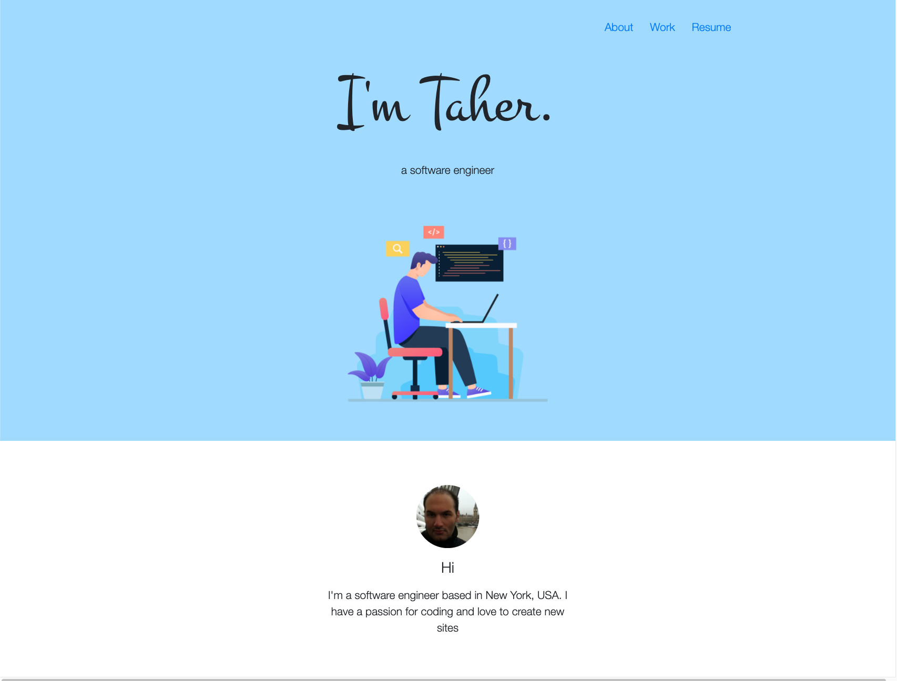

# Portfolio

A modern, responsive portfolio website showcasing my software engineering projects and experience.

[](https://github.com/tabouzeid/bio/actions)

[**Live Demo →**](#) <!-- Add your Vercel URL here -->



## About

Personal portfolio website built with React, featuring a clean and modern design to showcase my work as a software engineer. The site includes project showcases with live demos and GitHub repository links.

## Features

- **Responsive Design**: Optimized for all device sizes
- **Fast Performance**: Lazy-loaded images and optimized bundle sizes
- **Modern Stack**: Built with React 19 and React Router v7
- **Error Handling**: Graceful error boundaries for better UX
- **SEO Ready**: Proper meta tags and semantic HTML
- **Accessible**: WCAG compliant with descriptive alt texts

## Tech Stack

- **Framework**: React 19
- **Routing**: React Router v7
- **Styling**: Bootstrap 4 + Custom CSS
- **Build Tool**: Create React App
- **Deployment**: Vercel
- **CI/CD**: GitHub Actions

## Getting Started

### Prerequisites

- Node.js 20.x or higher (see `.nvmrc`)
- npm or yarn

### Installation

```bash
# Clone the repository
git clone https://github.com/tabouzeid/bio.git

# Navigate to project directory
cd bio

# Install dependencies
npm install

# Start development server
npm run dev
```

The app will open at [http://localhost:3000](http://localhost:3000)

## Available Scripts

| Command | Description |
|---------|-------------|
| `npm run dev` | Start development server with hot reload |
| `npm run build` | Create optimized production build |
| `npm run preview` | Preview production build locally |
| `npm test` | Run tests in watch mode |
| `npm run test:coverage` | Run tests with coverage report |
| `npm run analyze` | Analyze bundle size (requires build first) |

## Project Structure

```
bio/
├── public/              # Static assets
│   └── assets/          # Images, documents, icons
├── src/
│   ├── components/      # React components
│   │   ├── Header/      # Navigation header
│   │   ├── Footer/      # Site footer with social links
│   │   ├── FrontPage/   # Landing page
│   │   ├── WorkPage/    # Projects showcase
│   │   ├── ProjectDetail/ # Individual project card
│   │   └── ErrorBoundary/ # Error handling
│   ├── data/            # Data files
│   │   └── projects.js  # Project information
│   ├── App.js           # Main app component with routing
│   └── index.js         # Application entry point
├── .github/
│   └── workflows/       # CI/CD pipelines
└── vercel.json          # Vercel deployment config
```

## Deployment

### Deploy to Vercel

The easiest way to deploy:

```bash
# Install Vercel CLI
npm install -g vercel

# Deploy
vercel
```

Or connect your GitHub repository to Vercel for automatic deployments on every push to master.

### Manual Deployment

```bash
# Create production build
npm run build

# Deploy the 'build' folder to your hosting service
```

The build creates an optimized production bundle in the `build/` directory with:
- Minified JavaScript and CSS
- Hashed filenames for cache busting
- Optimized images and assets

## CI/CD

This project uses GitHub Actions for continuous integration:
- Runs tests on Node 18 and 20
- Creates production builds
- Runs on every push to master and all pull requests

## Performance Optimizations

- **Lazy Loading**: Images load only when visible
- **Code Splitting**: Automatic code splitting via React Router
- **Caching**: Aggressive caching headers for static assets (1 year)
- **Bundle Optimization**: Tree shaking and minification

## Browser Support

- Chrome (last 2 versions)
- Firefox (last 2 versions)
- Safari (last 2 versions)
- Edge (last 2 versions)

## Contact

**Taher Abouzeid**

- GitHub: [@tabouzeid](https://github.com/tabouzeid)
- LinkedIn: [taherabouzeid](https://www.linkedin.com/in/taherabouzeid/)
- Email: tabouzeid@gmail.com

## License

This project is open source and available under the [MIT License](LICENSE).

---

Built with ❤️ using React
